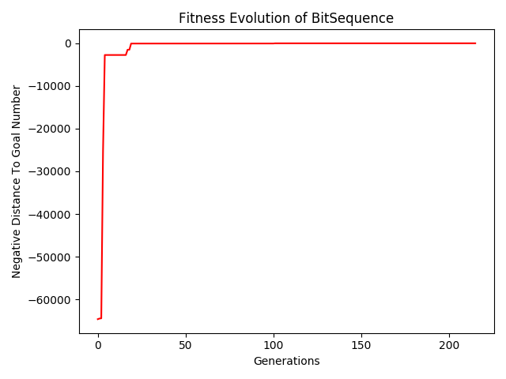
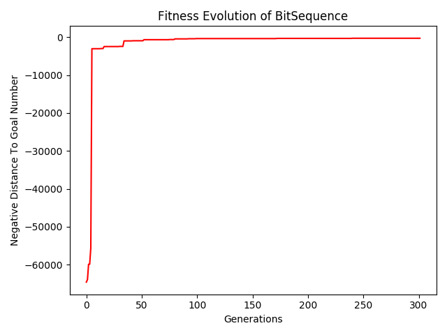
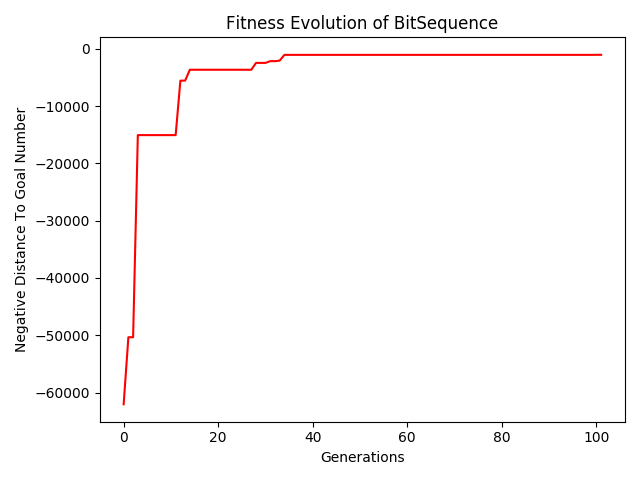

**Implementación del Algoritmo**

Para la implementación de la tarea se utilizan las librerias de nodos y generación aleatorea de AST subidos a material docente. El algoritmo
fue reutilizado de la Tarea 2

***Modificación del algortimo***

El algoritmo fue modificado solo en las operaciones de crossover y mutación manteniendo el cuidado de no dejar referencias colgantes

***Problema de encontrar número***

Para la primera iteración de solución del problema se utilizó como funcion de fitness simplemente la distancia absoluta al número buscado, teniendo
como objetivo minimizar aquella.

Para lograr el éxito en la busqueda de 65346 se redujo la profundidad máxima de los arboles nuevos generados a 2.

Para limitar la extensión de los arboles se estimó que tener un nodo más en el arbol equivale a alejarse 20 posiciones de el número deseado

A la hora de restringir los terminales queremos que no se repita ninguno por lo cual toda repetición se castiga severamente de tal manera de alejar el
resultado en factores de 1000 numeros

***Implementación de variables***

La implementación de variables consiste en tratar a cada variable como un diccionario donde existen los siguientes campos:
<li> name: Nombre de la variable, sea esta "x","y","z",etc.
<li> "*": Numero terminal por el cual se está multiplicando esta variable, es un entero.
<li> "+": numero terminal por el cual se está sumando esta variable.
<li> "*v": arreglo de todas las variables que se están multiplicando por esta variable. Puede haber instancias de la misma variable aquí
<li> "+v": arreglo de las variables que se están sumando con esta variable.

A la hora de evaluar entonces es posible evaluar cada variable de acuerdo a los campos que posee durante o despues de la ejecución del programa


**Symbolic regression**

Esta parte no fue implementada debido a falta de tiempo, pero la idea para su realización es que la funcion de fitness primero
reduzca los diccionarios lo más posible y luego chequee que sus campos cumplen con lo deseado de la ecuación. 

Por ejemplo que el diccionario principal se vea así:

```python
{"name":"x","*":1,"+":-6,"*v":[{"name":"x","*":1,"+":0,"*v":[],"+v":[]}],"+v":[{"name":"x","*":1,"+":0,"*v":[],"+v":[]}]}
```
Esto es facilmente evaluable si se mantiene el orden de jerarquía de cada campo

**Division por 0**


En el caso de division por 0, se estima que implementando una sección con try catch para atrapar la excepción será posible identificar y seleccionar para el borrado
todo arbol conflictivo.


**Resultados**

Se presentan los resultados en orden de la progresión de las funciones de fitness de los distintos ejercicios.

**Encontrar una secuencia que dé 65346:**
Hubo éxito.
 
FINDNUMBER 65346


Goal value: 65346


Obtained Sequence: 


(((25 * 25) * (2 + 100)) + (((7 - 2) + max({(8 - 4), (100 - 100)})) + (((7 + 8) * (7 + 100)) - max({4, (25 - 7)}))))


**Encontrar una secuencia que dé 65346 limitando el largo del arbol**

FINDNUMBER


Goal value: 65346


Obtained Sequence: max({(100 * ((25 * 25) + (4 * 7))), 100})


Obtained Value:65300


**Encontrar una secuencia que de 65346, restringiendo los terminales**

FINDNUMBER


Goal value: 65346


Obtained Sequence: (((25 * 25) + (8 - (7 - 2))) * (100 + 4))


Obtained Value:65312









